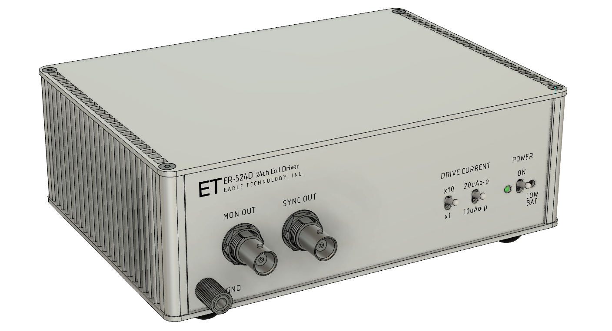
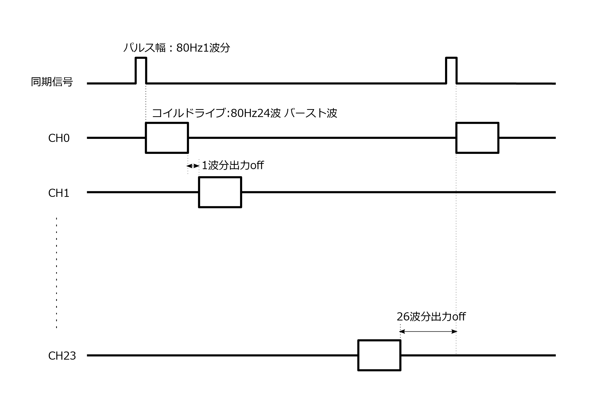
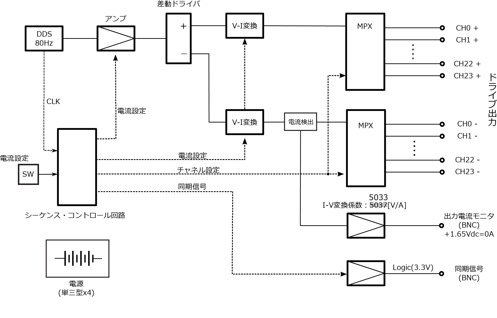

<!-- 
基本資料はこちら：
BOXで、 ESM50902 を検索
SQUID用と比べて電流値が大きかも。
 -->

> [!NOTE]
> 資料などについてコメント等あればDiscussionsに投稿ください。

# 機器名
**キャリブレーションコイルドライバ　ER-524D**

# 機器の概要

## 用途・目的
<!-- 本製品は磁気センサの感度・位置校正を行うための基準磁場を発生するためのコイルを定電流駆動する駆動回路です。
適切に設計・配置されたコイルでキャリブレーションコイルドライバにより基準となる磁場を発生させ、磁気センサから得られた磁場の強度信号とコイルドライバからの印加電流強度信号を以て磁気センサの感度・位置を校正することが可能です。 -->

複数の磁気センサをアレイ状に配置し磁場計測を行う場合、各センサ位置とその感度の両方を校正する必要があります。寸法や巻き数などのパラメタが管理されて製作されたコイル（キャリブレーションコイル）とそれを規定の電流で駆動する回路により基準となる磁場を発生させ、その磁場を計測することで校正が可能となります。この「キャリブレーションコイルドライバ」は校正作業に必要なキャリブレーションコイルを規定の電流で駆動するために設計された回路です。
> [!NOTE]
> 磁気センサの校正は以下の手順で行われます：
> 1. **センサとコイルの配置設定**：キャリブレーションコイル（複数）を校正対象の磁気センサに対して適切な位置に配置
> 2. **基準磁場の発生**：コイルドライバにより既知の強度の磁場を複数の異なる場所で発生させ、その磁場を校正対象のセンサで計測する
> 3. **信号比較**：磁気センサにより発生した磁場の強度とコイルドライバの電流信号を計測
> 4. **校正実行**：両者の計測結果を基に磁気センサの感度と位置を校正

## 機能
- 交流の電流を各コイルに時分割で供給し駆動します。
- 各コイルの駆動はバースト波状の正弦波信号です。
- コイルを駆動する電流はパネルのスイッチで切り替えが可能です。
- コイルに流れる電流は電圧としてモニタができます。
- 流れている電流と上記のモニタ端子の電圧を測定器を用いて値づけすることにより、コイルに流れる電流値が計測できます。
- 単三型充電池4本で動作します。

## 性能
- 駆動信号周波数： 80Hz
- 駆動電流波形：正弦波
- 電流出力：200 / 100 / 20 / 10 [μAo-p]
- 駆動チャネル数：24（設計により変更可能）
 
> [!NOTE]
>  **駆動対象**
> 駆動の対象となるコイルは、十分直流インピーダンスが低く、インダクタンスが小さいことを想定しています。具体的には **（駆動可能なインピーダンスを計算して示す）**　Ω以下の直流インピーダンスで10μH以下を想定しています。
> 

## バリエーション
本器の「負荷に電流を供給しその電流値を計測する」という機能により、生体磁場信号をエミュレートするための「ファントムコイル」をドライブすることに最適化した「ファントムドライバ」を作成可能です。磁場センサのキャリブレーションとは異なる電流設定（磁場強度設定）が必要な場合は出力電流の再設計が必要です。
> [!NOTE]
> **駆動電流の変更**
> 駆動電流の変更には回路定数の変更が必要となります。使用しているデバイスの性能から駆動電流の最大値は5mAo-p程度です。これ以上の電流が必要な場合は、回路定数の変更と同時にオペアンプの変更を検討してください。
>
> 

# 機器の構成 
コイルを駆動するための回路本体のみです。
キャリブレーションコイルそのものについては、この設計情報に含まれません。

# 動作の概要

### 駆動可能なコイルの数
この回路で駆動できるコイルの数は24個です。キャリブレーションコイルは３軸方向に磁場を発生させることを想定しており、３個のコイルが１つのコイルセットとなり、さらにそれを８個（３軸のコイルセットを８個）駆動できます。
駆動のための信号は多ピンコネクタ（ハーフピッチ50pin-SCSIコネクタ）に出力されますので、適宜コイルと接続するためのジグやケーブルの製作が必要となります。
> [!NOTE]
> 多ピンのコネクタは近年入手が困難になってきています。新たに製作される場合は3ピン〜6ピン程度の小型コネクタを複数利用するのが得策かと思います。

回路設計としては最大50個のコイルが駆動できるようになっていますので、ユーザの用途に応じてチャネル数を変更できます。

### 駆動波形
駆動は内部の正弦波発振回路に同期した正弦波のバースト波により時分割で行われます。駆動の様子を図示しました。
24個のコイルの駆動が1つのコイル駆動シーケンスとなり、それが繰り返されます。

まず、そのシーケンスの開始を示すため同期信号が正弦波の1周期の時間だけアサートされます。
同期信号がネゲートされると最初のコイルが駆動が始まります。
コイルは正弦波の24周期の時間だけ駆動され、1周期分の駆動休止時間が続き、次のコイルの駆動へと移ります。
最後のコイルが駆動された後、正弦波25周期分の長い駆動休止時間があり、コイルドライブの1周期が完了します。

駆動するコイルの順番やチャネル数、バースト波の波数と休止波数、正弦波の周波数は回路（HDL）で設定することができます。デフォルトでは、チャネル数24、正弦波の周波数80Hz、バースト波の波数24、休止波数1となっています。

<!-- 駆動用の正弦波は内部(DDSによる)で生成していますが、外部から供給することも可能です。この場合、信号の振幅が直接コイル駆動の電流値に変換されますので、供給する信号の振幅設定を確認してご利用ください。 -->

（下記「コイル駆動のタイミングチャート」を参照）

### 電流モニタ端子
コイルに流れる電流をモニタするための端子を備えています。
アナログ電圧出力で、0A = 1.65V となっています。
電流・電圧変換係数は、設計値で5033[V/I]となっています。

### 駆動電流の切り替え
駆動電流は、10μAo-p, 20μAo-p, 100μAo-p, 200μAo-pの４点切り替えです。
2つのトグルスイッチで設定します。

### 同期信号
24個のコイル駆動シーケンスの最初に正弦波の1周期の時間だけアサートされます。
レベルは0−3.3V、アクティブHi（正論理）です。

# 仕様
- ドライブコイル数：24
  
- 駆動電流 　(スイッチによる　4点切り替え)
  - 10/20/100/200μAo-p
  
- インターフェイス  
  - 同期信号出力：0−3.3Vロジック出力（正論理）
  - 駆動電流モニタ出力
    - アナログ電圧による（1.65V中心に+/-1V振幅）
    - 電流電圧変換係数：5033\[V/I] (設計値)
  
- 操作：フロントパネルトグルスイッチによる電源のOn/Off
  
- 表示
  - 電源電圧低下警告 Low-Battery（LED:赤）
  - 動作表示 (LED:緑)
  
- 電源：単三充電池（Ni-MH）4本
  

## コイル駆動のタイミングチャート
<!--  -->

## ブロック図

 

