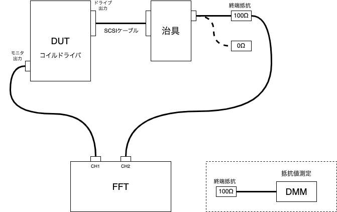

# モニタ出力の値づけ（キャリブレーション）
このノートでは、コイルドライバの電流モニタ出力の電圧値とコイルを流れる電流値の係数（電流電圧変換係数）を実測値から値づけする手順例を示します。  
この作業はコイルに流れる実際の電流値を電流モニタ出力の電圧から把握するために不可欠です。  
この手順は実際に機器を製造するときに用いた方法ですが、他の方法でも値づけは可能だと思いますので参考までにご覧ください。</br>

## 修正履歴
- 初版：2025/07/25  宮本政和
---
# 概要
- キャリブレーション時の機器の接続


<!-- 図の編集は：https://app.diagrams.net/ にて figures/CalCoilDriver_Cal_block.drawio を開いてください-->

## キャリブレーションの目的

本装置は接続されたコイルを一定の電流で駆動し、その電流値は電流モニタ出力から電圧として観測できる様になっています。このモニタ出力の電圧値は設計された電流電圧変換係数に従いコイルに流れる電流に比例した電圧を発生しますが、部品のばらつき等によるエラーを含んでいます。このエラーを把握し、電流モニタ出力電圧から信頼性の高い電流値を推測するために電流電圧変換係数の値づけ(キャリブレーション)を行います。


値づけのためには、実際にコイルに流れる電流とコイルドライバのモニタ出力の電圧を同時に観測する必要があります。  

この値づけ作業の結果、算出されるのは以下のパラメタです。
- 電流モニタ出力の電流ー電圧変換係数 

## 値づけのための計測
値づけのための計測の概要は以下の通りです。

1. **コイルに流れる電流を直接計測する**  
  本来はコイルに流れている電流を電流計のような測定器で直接計測するのがベターだと思いますが、ここではコイルの代わりに終端抵抗を駆動し、その両端に発生する電圧を測定することで流れている電流を推測します。  
  直流抵抗がほぼゼロのコイルを駆動した時と比較して、発生した電圧の分だけ駆動電流の絶対値は低くなります。しかし、変換係数の値づけに電流の絶対値は関係しないため問題ないと判断しています。（リニアリティは回路・部品で担保されていると想定しています）  
  コイルを駆動した時の電流値については、変換係数の算出後に終端抵抗を0Ωにして確認します。  
  
1. **同時に電流モニタ出力の電圧値を計測する**  
上記の終端抵抗に発生する電圧の計測と同時に、装置の電流モニタ出力の電圧計測します。  
これにより、「同じ電流を2つの方法で測定した結果」を得ることができます。

1. **同時に電流モニタ出力の電圧値を計測する**  
終端抵抗の電圧計測を基準として電流モニタ出力の電圧を値づけする計算を行います。  

# 必要機器
- **DMM(抵抗測定)**  
  終端抵抗の値を計測します。確度高く計測するために４端子法での計測をお勧めします。
- **信号モニタ用ジグ**  
  コイルドライバの出力(SCSIコネクタ)をBNCに変換するためのジグです。コイルドライブ出力に終端抵抗を接続するために使用します。</br>
- **SCSIケーブル**  
  信号モニタ用ジグと機器を繋ぐケーブルです</br>
- **終端抵抗(100Ω/0Ω)**  
    ドライブされるコイルのダミーとして使います。100Ωの両端の電圧を計測することで、実際にコイルに流れる電流を算出します。  
    0Ωの終端抵抗は、モニタ出力の値づけ後にコイルに流れる電流値を確認するために使用します。</br>
- **FFTアナライザ**  
  コイルドライバのモニタ出力端子と終端抵抗の交流電圧を計測します。非常に小さい電圧（1mVrms程度）を計測するので、ノイズを含めて計測してしまう交流電圧計は使用できません。  
  ロックインアンプでも計測可能だと思います。  
  モニタ出力の電圧値とコイルに流れる電流（終端抵抗の両端の電圧）を同時に計測する必要があるため、2ch同時計測できる計測器が望ましいです。また、測定器の入力は測定器のGNDからフロートしている必要があります。  

# 手順

## 0. 注意事項

* **測定環境:** 温度変化などにより抵抗値や回路特性が変動する可能性があるため、安定した環境で測定を行ってください。
* **測定確度:** 使用する計測機器の測定確度がキャリブレーション結果に直接影響します。
## 1. setup
### 本装置を出力固定モードに変更する
本体のUI基板上にある「TEST/NORMAL」切り替えジャンパを「TEST」側に設定します。これにより駆動チャネルが固定されます。 
固定されるチャネルは回路図上の表記で「DRIVE_13」となり、SCSIコネクタ上では「13,38」のペアになります。  
（写真）
### 駆動電流値を設定する
測定する駆動電流をフロントパネルから設定します。
### コイルドライブ出力コネクタに終端抵抗取り付け用のジグを接続
装置の裏側のコネクタに終端抵抗取り付け用のジグを接続します。ここではMEG用の周辺部品として手元にあった、SCSIコネクタをBNCコネクタに接続するジグと、SCSIケーブルを使用しました。  
(写真)

### 動作確認
装置の電源を入れ動作させます。終端抵抗取り付けるジグの端子から信号が連続して出ていることをオシロスコープで確認します。  

## 2. 計測
### 終端抵抗の抵抗値計測
終端抵抗の抵抗値を計測します。可能であれば4端子法を用いて計測すると確度が高い値を得る事ができます。  
この値で駆動電流を算出することになります。

### モニタ出力と終端抵抗両端の電圧計測
抵抗値を確認した終端抵抗をコイルドライブ出力コネクタに接続したジグに装着し、コイルのダミーとして動作させます。  
この終端抵抗の両端をFFTアナライザの入力に導入し、コイルに流れている実際の電流値として計測します。  
同時にモニタ出力端子をFFTアナライザの入力に導入し、コイルに流れている電流を装置で検出した結果として計測します。  
FFTには駆動周波数（標準では80Hz）にピークがある信号が検出されているので、そのピーク値を信号電圧とします。  
必要に応じて、平均化などを行い安定した測定値を得てください。

### 変換係数の算出
上記で得られた、終端抵抗の両端の電圧(Vr)とモニタ出力端子の電圧(Vm)、終端抵抗の値(Rt)から変換係数を算出します。  
コイルに流れている電流をId、求めたい電流電圧変換係数をkとすると

```math
\begin{aligned}
  &V_r=I_d R_t\\
  &V_m=k I_d\\
\end{aligned}
```
 ここから、

```math
k=\frac{V_m R_t}{V_r}
```


となるので、この式から電流電圧変換係数を計算します。
設計値は5033[V/A]です。（実質的に単位は[Ω]ですが、わかりやすさのため[V/A]としておきます）

### コイルに流れる電流値を測定
ここまでの計測はモニタ出力の電圧とコイルに流れる電流の関係を把握するための計測でしたが、電流検出のためにコイルの代わりに100Ωの終端抵抗をもちいたため、実際の磁場発生のためのコイルを接続した時に流れる電流値とは異なります。ここでは終端抵抗を0Ωにしてコイルに流れる電流値を確認します。  
終端抵抗を取り外し0Ωの抵抗に取り替え、実際のコイルが接続されたのと同様の状況を再現します。これにより実際のコイルに流れる電流値をモニタ出力端子の電圧の計測により算出します。  
この計測で、実際のコイルの駆動電流が意図した通りに実現されているかどうか判断します。


# まとめ
この作業でコイルドライバ回路のモニタ出力電圧に対して値づけ（電流ー電圧変換係数の実測）を行いました。これにより、モニタ出力電圧からコイルに流れている電流値を計算できるようになりました。また、コイルに流れる電流値が設計が意図している電流値であることを確認する事ができました。

